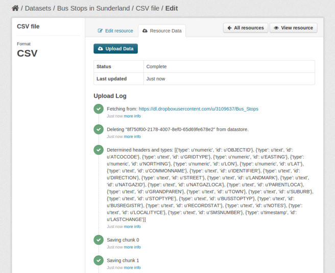

Using the |datapusher|
======================

The |datapusher| will work without any more configuration as long as the
``datapusher`` (or ``datapusherext`` for version 2.1) plugin is installed and
added to the ckan config file.

Triggering pushes
-----------------

Any file that has a format of csv or xls will be attempted to be loaded
into to DataStore. This is triggered when a new URL is added to a dataset
(resource). You can also manually trigger resources to be resubmitted.

CKAN 2.2 and above
~~~~~~~~~~~~~~~~~~

When editing a resource in CKAN (clicking the "Manage" button on a resource
page), a new tab will appear named "DataStore".
This will contain a log of the last attempted upload and an opportunity
to retry to upload.

CKAN 2.1
~~~~~~~~

If you want to retry an upload go into the resource edit form in CKAN and
just click the "Update" button to resubmit the resource metadata.
This will retrigger an upload.

From the command-line
~~~~~~~~~~~~~~~~~~~~~

Resubmit all resources to datapusher, although it will skip files whose hash of the data file has not changed::

    paster --plugin=ckan datapusher resubmit -c /etc/ckan/default/ckan.ini

Resubmit a specific resource, whether or not the hash of the data file has changed::

    paster --plugin=ckan datapusher submit <pkgname> -c /etc/ckan/default/ckan.ini

Configuring the maximum upload size
-----------------------------------

By default the ``datapusher`` will only attempt to process files less than 10Mb
in size.  To change this value you can specify the MAX_CONTENT_LENGTH setting in
datapusher_settings.py

    MAX_CONTENT_LENGTH = 1024  # 1Kb maximum size

Configuring the guessing of types
---------------------------------

The ``datapusher`` uses Messytables_ in order to infer data types. A default
configuration is provided which is sufficient in many cases. Depending on your
data however, you may need to implement your own ``Messytables`` types.

You can specify the types to use with the following settings in your datapusher_settings.py::

    TYPES = [messytables.StringType, messytables.DecimalType, YourCustomType...]
    TYPE_MAPPING = {'String': 'text', 'Decimal': 'numeric', 'YourCustom': 'timestamp'... }

.. _Messytables: https://messytables.readthedocs.org/en/latest/

Configuring SSL verification
----------------------------

By default ``datapusher`` will verify that requests to CKAN and other servers
with HTTPS are with a valid SSL/TLS certificate. However the default list of
root certificates is usually held by the operating system, and often gets out of
date, causing SSL verification errors. (Browsers usually have their own list and
update it frequently.)

The suggested fix is to use the latest version of ``requests`` and its
'security' addition::

    pip install -U requests[security]

There are no known compatibility issues with CKAN or common extensions by using
a more recent version of requests. (However requirements.txt still pins the
version, as per the ckan policy.)

If you still have problems verifying certificates, or maybe for test purposes,
you can switch the verification off in datapusher_settings.py::

    SSL_VERIFY = False
